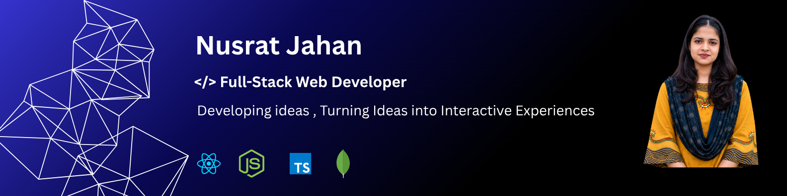

Hi  My name is Nusrat Jahan
=====================================================================================================================================

Learning Full-Stack Web Development
-----------------------------------

👩‍💻 Aspiring Full-Stack Developer | Passionate about building clean, responsive & user-friendly web experiences | Exploring React, Next.js & modern web technologies 🚀

* 🌍  I'm based in Bangladesh
* ✉️  You can contact me at [nusratjahannila2122232425@gmail.com](mailto:nusratjahannila2122232425@gmail.com)
* 🧠  I'm currently learning React
* 💬  Ask me about Building a Portfolio with interactive features

### Socials

 <a href="https://www.github.com/code-by-nusrat" target="_blank" rel="noreferrer"> <picture> <source media="(prefers-color-scheme: dark)" srcset="https://raw.githubusercontent.com/danielcranney/readme-generator/main/public/icons/socials/github-dark.svg" /> <source media="(prefers-color-scheme: light)" srcset="https://raw.githubusercontent.com/danielcranney/readme-generator/main/public/icons/socials/github.svg" />  </picture> </a>

### Badges

<b>My GitHub Stats</b>

<b>Top Repositories</b>

       
