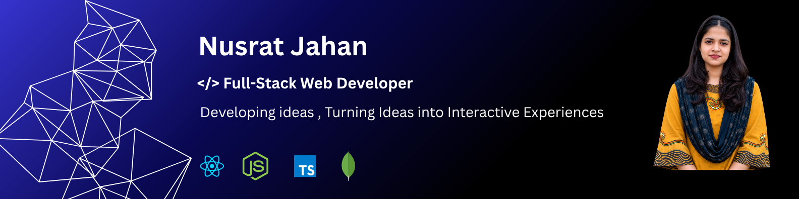

<h1 data-importer="text" align="center">Hi  👋. I'm Nusrat Jahan</h1>
<h3 data-importer='text' align='center'>Fronted Developer . Crafting web Experiencing With React & Next.js</h3>

 

<h1 data-importer="text" align="left">💫 About Me:</h1>

###

<h3 data-importer="text" align="left">Hey, I'm Nusrat Jahan 👋.I'm an aspiring Full-Stack Web Developer passionate about turning ideas into clean, responsive, and user-friendly web applications.</h3>

###

* 🌱 Currently learning and building projects with React, JavaScript, TypeScript, and Next.js * 💻 Interested in Frontend & Full-Stack Web Development * 🎨 Enjoy creating responsive and interactive user interfaces * 🚀 Continuously improving my coding and problem-solving skills * 🛠️ Working with technologies like HTML, CSS, JavaScript, React, Next.js, Tailwind CSS, Node.js, and MongoDB * 📚 I believe in learning by building real-world projects * 🎯 My goal is to become a skilled Full-Stack Developer * 💡 Always excited to learn new technologies and turn ideas into code

###
 

<h2 data-improper="text" align="left">🌐 FOLLOW ME ON SOCIALS:</h2>

###

 

 

###
 

<h2 data-importer="text" align="left">💻 TECHNOLOGY STACK</h2>

###

<h4 data-improper='text' align='left'>Languages</h4>

###

 
  
 
  
  
  
 
  

###

<h4>CSS Frameworks & Libraries</h4>

<!-- 

  
  
  
  
  
  
  
  
 
  
  
  
  

 -->

###

